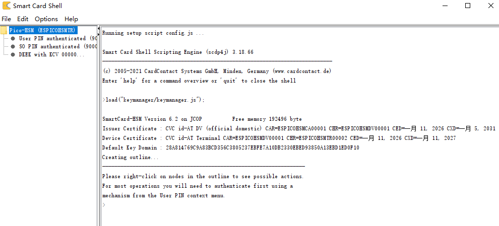

## Install
```
pip install pycvc
```
And  
```
https://github.com/librekeys/pypicokey-mirror
https://github.com/librekeys/pypicohsm
```


## Setup the CA:
```
openssl ecparam -out ESPICOHSMCA00001.pem -name prime256v1 -genkey
openssl pkcs8 -topk8 -nocrypt -in ESPICOHSMCA00001.pem -outform DER -out ESPICOHSMCA00001.pkcs8
cvc-create --role=cvca --type=at --chr=ESPICOHSMCA00001 --days=3650 --sign-key=ESPICOHSMCA00001.pkcs8 --scheme=ECDSA_SHA_256
```

## Setup the DV:
```
openssl ecparam -out ESPICOHSMDV00001.pem -name prime256v1 -genkey
openssl pkcs8 -topk8 -nocrypt -in ESPICOHSMDV00001.pem -outform DER -out ESPICOHSMDV00001.pkcs8
openssl ec -in ESPICOHSMDV00001.pem -out ESPICOHSMDV00001.pub -pubout -outform DER
cvc-create --role=dv_domestic --type=at --chr=ESPICOHSMDV00001 --days=1820 --sign-key=ESPICOHSMCA00001.pkcs8 --scheme=ECDSA_SHA_256 --sign-as=ESPICOHSMCA00001.cvcert --public-key=ESPICOHSMDV00001.pub
```

## Modify `picohsm/PicoHSM.py`

https://github.com/librekeys/pypicohsm/blob/412aa07898a355beaec7f1b5da3895f8e85f5a09/picohsm/PicoHSM.py#L197

To:
```
            #j = get_pki_data('cvc', data=data)
            input_json = input("Enter a JSON string: ")
            j = json.loads(input_json)
```

## Run pico-hsm-tool.py
https://github.com/librekeys/pico-hsm/blob/master/tools/pico-hsm-tool.py

```
python pico-hsm-tool.py --pin 114514 initialize --so-pin 57621880
```

And script will stop and wait for input `Enter a JSON string:`
Copy the string behind `Public Point:`  
Leave this window open; do not close it.

## Run convertder.py
```
python convertder.py
```
Paste the string behind `Public Point:` here and hit enter

## Create cert
```
cvc-create --role=terminal --type=at --chr=ESPICOHSMTR00002 --days=365 --sign-key=ESPICOHSMDV00001.pkcs8 --scheme=ECDSA_SHA_256 --sign-as=ESPICOHSMDV00001.cvcert --public-key=public_key.pub
```

## Run convertcvc.py
```
python convertcvc.py
```
Open a notepad, copy all the output

## Uploade cert
Modify `ret.json` based on the output
Use any json minify tool(search on google) compress ret.json to 1 line
Paste compressed json to window `pico-hsm-tool.py`
Script should print `Certificate uploaded successfully!`

## Modify SCS3 tool

REF: https://github.com/librekeys/pico-hsm/blob/master/doc/scs3.md  
But instead of using:
```
ESPICOHSMCA00001: new CVC(new ByteString("***", HEX)),
ESPICOHSMCA00002: new CVC(new ByteString("***", HEX))
```
Copy the string behind `SCS3:` to `***` :
```
ESPICOHSMCA00001: new CVC(new ByteString("***", HEX))
```

Now we can use SCS3 to manage picohsm:
